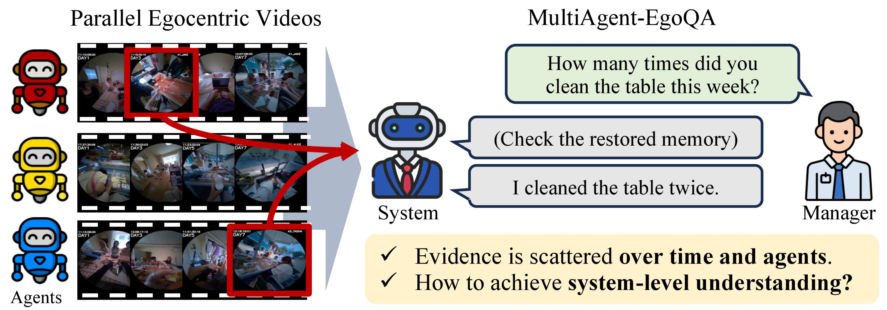
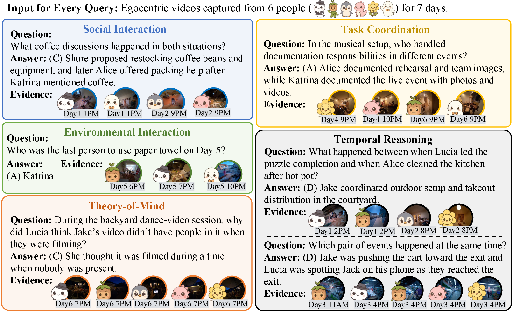
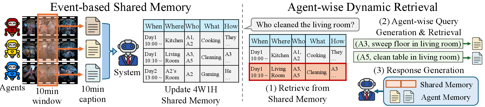

# MA-EgoQA: Multi-Agent Egocentric Video Question Answering

[](https://ma-egoqa.github.io)
[](https://arxiv.org/abs/2603.09827)
[](https://huggingface.co/datasets/KangsanKim71/MA-EgoQA)

## Overview

**MA-EgoQA** is the first benchmark for question answering over multiple long-horizon egocentric video streams from embodied agents. As intelligent agents increasingly assist our physical activities, understanding events collectively observed by multiple agents becomes essential — yet remains largely unexplored.

MA-EgoQA is built on the [EgoLife](https://egolife-dataset.github.io/) dataset, where **6 people** lived together for **7 days** wearing egocentric cameras, resulting in **266 hours** of multi-agent video. Every question requires reasoning across **more than two agents' observations**.

<p align="center">
  
</p>

---

## MA-EgoQA Benchmark

### Five Question Categories

| Category | Abbr. | Description |
|---|---|---|
| Social Interaction | SI | Localizing conversations and group behaviors across video streams |
| Task Coordination | TC | How agents divide roles and collaborate toward shared goals |
| Theory of Mind | ToM | Reasoning about agents' beliefs, intentions, and mental states |
| Temporal Reasoning | TR | Concurrency and ordering of events across agents' timelines |
| Environmental Interaction | EI | Tracking distributed object usage across agents |

<p align="center">
  
</p>

---

## EgoMAS Baseline

We propose **EgoMAS** (Egocentric Multi-Agent System), a training-free baseline that addresses the unique challenges of multi-agent egocentric reasoning.

<p align="center">
  
</p>

## Run EgoMAS

### 1. Clone the Repository and Install
```sh
git clone https://github.com/KangsanKim07/MA-EgoQA.git
cd MA-EgoQA
pip install -r requirements.txt
```

### 2. Download the MA-EgoQA dataset from HuggingFace to the `data/` directory
```sh
huggingface-cli download KangsanKim71/MA-EgoQA --local-dir data --repo-type dataset
```

### 3. Construct Event-based Shared Memory with 10-min Window
```sh
python egomas/src/construct_shared_memory.py
```
Set `GEMINI_API_KEY` or `GOOGLE_API_KEY` before running this step. On shared machines, you can limit parallel API calls with `EGOMAS_NUM_WORKERS`, for example `EGOMAS_NUM_WORKERS=2`.

### 4. Index Captions with BM25
```sh
python -m egomas.src.index_bm25
```

### 5. Inference EgoMAS with Agent-wise Dynamic Retrieval
```sh
python -m egomas.src.inference_egomas  # Multi-process
```
You can run EgoMAS with a single process by run:
```sh
python -m egomas.src.inference_egomas_singleproc
```

### Fixed Single-Agent Evaluation
To evaluate a lower-bound ablation where every question is answered from only one fixed agent's 30-second caption stream:
```sh
python -m egomas.src.inference_egomas_fixed_one --agent Jake
```
Run all six fixed agents:
```sh
python -m egomas.src.inference_egomas_fixed_one --agent all
```
This keeps the multi-agent EgoMAS scripts unchanged.


### Qwen3VL Fixed-Source Ablation

This repository snapshot also includes a Qwen-only fixed-source ablation runner. It does not modify the Gemini EgoMAS scripts. It reuses the official MA-EgoQA questions and the existing 30-second caption BM25 index, so it does not require downloading full videos.

```sh
# Default Lucia/Tasha/Shure singles and pairs
QWEN3VL_LIMIT=none sbatch hpc/run_qwen3vl_subset_h200.sbatch

# Custom source combinations
QWEN3VL_LIMIT=none \
QWEN3VL_CONDITIONS="Jack Alice Katrina Jack_Alice Jack_Katrina Alice_Katrina" \
sbatch hpc/run_qwen3vl_subset_h200.sbatch
```

Summaries are produced with:

```sh
python -m egomas.src.summarize_qwen3vl_subset --output-root outputs/qwen3vl_subset
```

The 2026-06-04 full-run artifacts are stored in `../results/2026-06-04_qwen3vl_maegoqa/`.


### Qwen3VL Route B: Per-Agent SigLIP Frame Retrieval

Route B is the visual-retrieval version of the Day 1 Qwen3-VL experiment. It is meant to be compared with Route A, not to replace the original Gemini EgoMAS baseline.

Route A and Route B use the same experimental conditions:

```text
MA-EgoQA Day 1 question
-> read the structured contexts field
-> use the context day/time window to locate video clips
-> use the context agent list to form:
   single: each relevant agent alone
   pair: every two-agent combination
   all: all relevant context agents
```

The difference is how frames are selected:

```text
Route A
-> uniformly sample a fixed number of frames per selected agent
-> frames + question + options into Qwen3-VL

Route B
-> dense-sample candidate frames from each selected agent
-> SigLIP encode candidate frames
-> SigLIP encode question + options
-> rank frames by text-image similarity
-> select per-agent top-k with MMR + temporal NMS
-> selected frames + question + options into Qwen3-VL
```

Route B does not give Qwen captions, transcripts, BM25 results, or semantic text from `contexts`. The `contexts` field is only used as a localization signal: which Day 1 time window and which agents' videos should be considered.

#### Frame Budget

Route B uses per-agent top-k, so it is comparable with Route A's per-agent frame modes:

```text
single top_k=5 -> 5 total frames
pair top_k=5   -> 10 total frames
all top_k=5    -> 5 * number_of_relevant_agents total frames
```

Use `top_k=5`, `top_k=10`, and `top_k=15` to compare with Route A `frame_modes=5`, `10`, and `15`.

#### Core Files

```text
egomas/src/evaluate_day1_qwen3vl_routeb_retrieval.py
egomas/src/merge_routeb_retrieval_results.py
hpc/run_routeb_siglip_h200.sbatch
```

The Slurm job is chunk-local: each job performs candidate frame sampling, SigLIP retrieval, and Qwen inference together. Do not build a separate global 1fps frame-index job for the formal Route B runs.

#### Expected Torch Paths

On NYU Torch, the current setup expects:

```sh
PROJECT_ROOT=/scratch/$USER/github_sync_long_video_understanding
MAEGOQA_ROOT=$PROJECT_ROOT/MA-EgoQA
BENCHMARK_PATH=/scratch/$USER/ma_egoqa_reproduce/MA-EgoQA/data/MA-EgoQA.json
VIDEO_ROOT=/scratch/$USER/data/MaEgo
```

The Slurm script requests one H200 GPU:

```text
#SBATCH --account=torch_pr_674_tandon_advanced
#SBATCH --gres=gpu:1
#SBATCH --constraint=h200
```

If your benchmark or video paths differ, override them with `ROUTEB_BENCHMARK_PATH` and `ROUTEB_VIDEO_ROOT`.

#### Smoke Test

Run one Day 1 question first:

```sh
cd /scratch/$USER/github_sync_long_video_understanding/MA-EgoQA
OUTDIR=/scratch/$USER/data/multiresult/routeB_siglip_day1_top5_chunklocal
mkdir -p "$OUTDIR"

ROUTEB_LIMIT=1 \
ROUTEB_TOP_KS="5" \
ROUTEB_RETRIEVAL_BATCH_SIZE=256 \
ROUTEB_OUTPUT_PATH="$OUTDIR/smoke_top5_chunklocal.json" \
ROUTEB_SAVE_EVERY=1 \
sbatch --time=01:55:00 hpc/run_routeb_siglip_h200.sbatch
```

Check status and logs:

```sh
squeue -u $USER
tail -n 80 hpc/logs/routeb_siglip_<jobid>.out
tail -n 80 hpc/logs/routeb_siglip_<jobid>.err
```

The smoke output should contain raw predictions plus a `.summary.csv` next to the JSON file.

#### Formal Day 1 Run

Submit one top-k budget at a time. This example runs `top_k=5` over all 253 Day 1 questions in 26 short chunks:

```sh
cd /scratch/$USER/github_sync_long_video_understanding/MA-EgoQA
TOPK=5
OUTDIR=/scratch/$USER/data/multiresult/routeB_siglip_day1_top${TOPK}_chunklocal
mkdir -p "$OUTDIR"

for START in 0 10 20 30 40 50 60 70 80 90 100 110 120 130 140 150 160 170 180 190 200 210 220 230 240 250; do
  LIMIT=10
  if [ "$START" -eq 250 ]; then LIMIT=3; fi
  END=$((START + LIMIT - 1))

  ROUTEB_START_INDEX="$START" \
  ROUTEB_LIMIT="$LIMIT" \
  ROUTEB_TOP_KS="$TOPK" \
  ROUTEB_RETRIEVAL_BATCH_SIZE=256 \
  ROUTEB_OUTPUT_PATH="$OUTDIR/chunk_${START}_${END}.json" \
  ROUTEB_SAVE_EVERY=1 \
  sbatch --time=01:55:00 --job-name="rb${TOPK}_${START}_${END}" hpc/run_routeb_siglip_h200.sbatch
done
```

To run another budget, change `TOPK=10` or `TOPK=15` and use the corresponding output directory.

#### Merge Results

After every chunk finishes with exit code `0:0`, merge the chunks:

```sh
cd /scratch/$USER/github_sync_long_video_understanding/MA-EgoQA
TOPK=5
OUTDIR=/scratch/$USER/data/multiresult/routeB_siglip_day1_top${TOPK}_chunklocal

python -m egomas.src.merge_routeb_retrieval_results \
  --input-glob "$OUTDIR/chunk_*.json" \
  --output-path "$OUTDIR/merged_top${TOPK}.json" \
  --strict
```

This writes:

```text
merged_top5.json
merged_top5.summary.csv
```

The raw JSON contains every trial with:

```text
question, answer, selected agents, selected frames, candidate frame count,
raw Qwen response, parsed prediction, correctness, retrieval latency, Qwen latency
```

The summary CSV contains rows that are easy to paste into a shared spreadsheet:

```text
group=single_agent  -> JAKE, ALICE, KATRINA, LUCIA, TASHA, SHURE
group=pair_agent    -> all 15 unordered pairs, e.g. JAKE_ALICE
group=all_agents    -> all relevant context agents for each question
group=single_best   -> oracle upper bound over single-agent trials
group=pair_best     -> oracle upper bound over pair-agent trials
```

#### Completed Top-k=5 Reference Result

The completed Day 1 `top_k=5` run on Torch produced:

```text
Output directory:
/scratch/xy3257/data/multiresult/routeB_siglip_day1_top5_chunklocal

Merged files:
merged_top5.json
merged_top5.summary.csv

Trials: 2964
Overall accuracy: 30.33%
Single-agent average accuracy: 28.31%
Pair-agent average accuracy: 30.43%
All-context-agents accuracy: 37.15%
```

Interpretation:

```text
Route B vs Route A at the same per-agent budget:
  compares SigLIP retrieval against uniform frame sampling.

single_agent vs pair_agent vs all_agents:
  tests whether adding more agents improves Qwen3-VL answer accuracy.

single_best and pair_best:
  are oracle upper bounds, useful for analysis but not deployable systems.
```

---

## Citation

```bibtex
@misc{kim2026maegoqa,
    title={MA-EgoQA: Question Answering over Egocentric Videos from Multiple Embodied Agents}, 
    author={Kangsan Kim and Yanlai Yang and Suji Kim and Woongyeong Yeo and Youngwan Lee and Mengye Ren and Sung Ju Hwang},
    year={2026},
    eprint={2603.09827},
    archivePrefix={arXiv},
    primaryClass={cs.CV},
    url={https://arxiv.org/abs/2603.09827}, 
}
```
